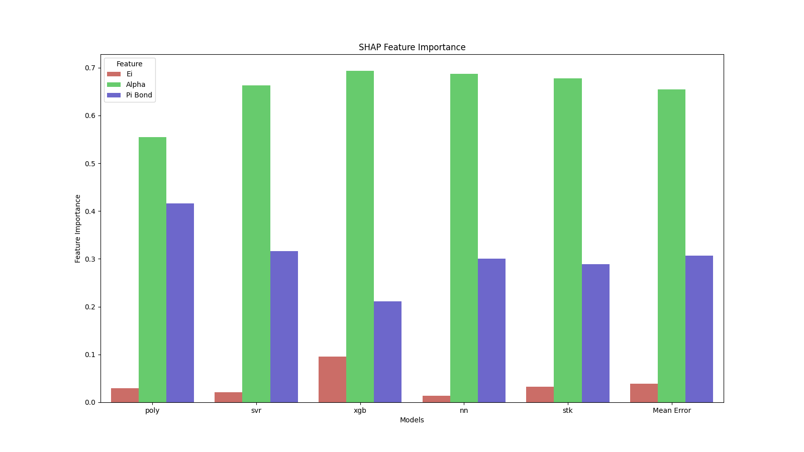
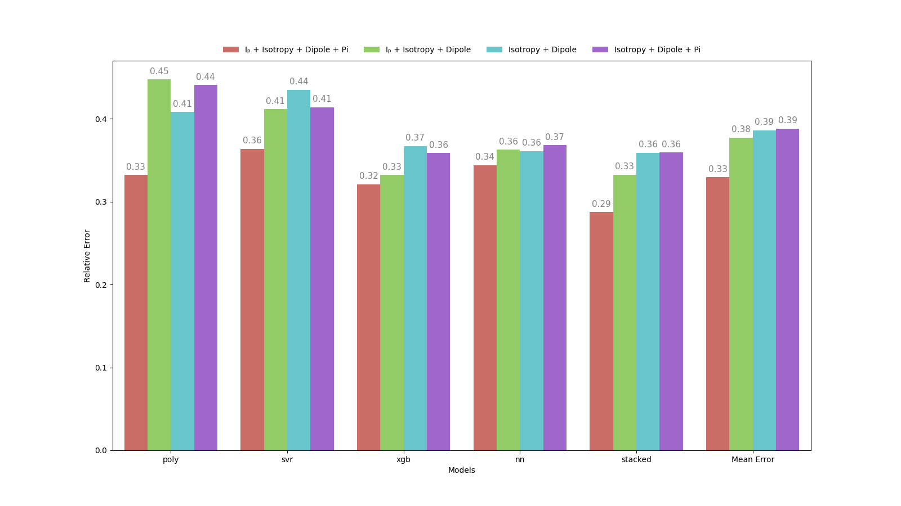
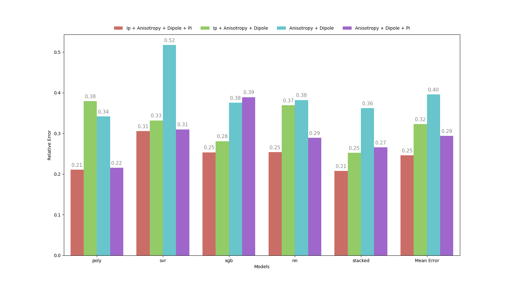

# Positron Binding Energy for Molecules

## Introduction
This is the main code of my master's research, where I intended to analyze for 3 sets of data, what were the main characteristics and the relationship between them. The main physical insights were obtained by importance and selection of resources, where we could see that there is a great agreement with the literature and many possibilities for new experiments and theories with the insights obtained here.

## The Reason
Until today, we have not been able to analytically calculate in the literature the binding energy of the positron with other molecules, whether non-polar or polar. And a way of being able to calculate this binding energy based on properties of molecules has been tried by various empirical methods. Hence the idea of ​​performing regressions with Machine Learning models, in the hope of generating some hint or even accurate predictions.

## Some Results
Of course, the physical explanations with more care and analysis will be in my dissertation and papers to be published. But I'll give you a small sample of what I got:



In the above image, Ei = Ionization Potential Energy, Alpha = Polarizability, Pi Bond = Number of Pi Bonds. We can see that the order of importance of features is Alpha > Pi Bond > Ei for apolar molecules, which completely agrees with what the literature expects about the relevance of each molecular property above.

Let's compare the difference in performances for polar molecules when we include Anisotropic Polarizability.
- Utilizing Isotropic Polarizability
    
- Utilizing Anisotropic Polarizability
    

For the best performance feature settings, which's all features together, the performance has improved in 8%! Which's a lot for this problem. This was just an example. Many insights are yet to come in the dissertation.

## For the Machine Learning Process
Since we are dealing with 3 small datasets, with the largest having 56 examples, I had to use techniques that avoided overfitting as much as possible, such as strong regularization. In this project I chose to use 4 famous estimators, the simplest being a [polynomial](https://scikit-learn.org/stable/modules/preprocessing.html#polynomial-features) regression done through [Ridge Regression](https://scikit-learn.org/stable/modules/generated/sklearn.linear_model.Ridge.html), the [SVR](https://scikit-learn.org/stable/modules/generated/sklearn.svm.SVR.html#sklearn.svm.SVR) estimator, [XGBoostRegressor](https://xgboost.readthedocs.io/en/stable/python/python_api.html), [MLPRegressor](https://scikit-learn.org/stable/modules/generated/sklearn.neural_network.MLPRegressor.html) and finally, a [Stacked Voting Regressor](https://scikit-learn.org/stable/modules/generated/sklearn.ensemble.VotingRegressor.html). The optimization of models was done via [Scikit-Optimize](https://scikit-optimize.github.io/stable/) within a nested cross-validation process to get an estimate of performance of each of the models for each feature combnations within each dataset.


## Tools used in this project
* [Poetry](https://towardsdatascience.com/how-to-effortlessly-publish-your-python-package-to-pypi-using-poetry-44b305362f9f): Dependency management - [article](https://towardsdatascience.com/how-to-effortlessly-publish-your-python-package-to-pypi-using-poetry-44b305362f9f)
* [hydra](https://hydra.cc/): Manage configuration files - [article](https://towardsdatascience.com/introduction-to-hydra-cc-a-powerful-framework-to-configure-your-data-science-projects-ed65713a53c6)
* [pre-commit plugins](https://pre-commit.com/): Automate code reviewing formatting  - [article](https://towardsdatascience.com/4-pre-commit-plugins-to-automate-code-reviewing-and-formatting-in-python-c80c6d2e9f5?sk=2388804fb174d667ee5b680be22b8b1f)
* [pdoc](https://github.com/pdoc3/pdoc): Automatically create an API documentation for the project

## Project structure
```bash
.
├── config
│   ├── data                     # Configs related to the data paths
│   ├── eval                     # Configs related to the algorith evaluation paths
│   ├── feat_importance          # Configs related to path images of feature importance
│   ├── main.yaml                # Main Configuration File
│   ├── models                   # Configs related to optimized models path
│   ├── opt                      # Configs related to features to optimize and hyperparameter search space of models
│   └── process                  # Configs related to preprocessing the data
├── data
│   ├── final                    # Folder containing the molecules that have anisotropic polarizability
│   ├── processed                # Folder containing all molecules, but processed
│   └── raw                      # Raw data
├── docs
│   └── src
├── executar_fila.sh             # File to execute in terminal all the files to get opt models and eval performances.
├── general 
│   ├── creating_data.py         # File to get the processed and final data.
│   └── save_performances_img.py # File to save img of performances since the performances has been already calculated.
├── LICENSE
├── Makefile                     # Store useful commands to set up the environment
├── models                       # Folder cointaining the optimized models for each dataset and feature settings.
│   ├── apolar                          
│   ├── polar                           
│   └── polar_apolar                    
├── notebooks
│   └── Apolar Molecules         # Folder cointaining unstructured notebook with some random tests
├── performances                 # Folder with the performances in csv files for each dataset
│   ├── apolar                          
│   ├── polar                          
│   └── polar_apolar                    
├── performances_imgs            # Folder with the performances in .png graphs for each dataset
│   ├── apolar
│   ├── polar
│   └── polar_apolar
├── poetry.lock                  # Poetry folder for versioning the project
├── pyproject.toml               # Dependencies installed for this project.
├── README.md
├── src                          # Folder cointaining general utilized functions cointained in the documentation.
│   ├── __init__.py
│   ├── __pycache__
│   └── utils
├── src_apolar                   # Folder with the whole process including feature importance results with apolar molecules
├── src_polar                    # Folder with the whole process including feature importance results with polar molecules
├── src_polar_apolar             # Folder with the whole process including feature importance results with polar + apolar molecules
├── transformers.py              # File to replace in skopt library
└── txt_outputs                  # Folder with the principal outputs of .py files.
```

## Set up the environment
1. Install [Poetry](https://python-poetry.org/docs/#installation)
2. Set up the environment:
```bash
make activate
make install
```

## Install new packages
To install new PyPI packages, run:
```bash
poetry add <package-name>
```
## Fixing some issues
### Optimization Library
The librarie used here to hyperparameter optimization (skopt) have some bugs that we have to fix mannually and it can be done just
by replacing the transformers.py file. One easy way to do this is get the directory returned by "poetry shell" command and do the following:
```bash
cp transformers.py {poetry_shell_path_returned}/lib/python3.9/site-packages/skopt/space/transformers.py
```
Where you just have do substitute the {poetry_shell_path_returned} with the path provided by poetry shell when activating the virtual environment.

### Running Jupyter Notebook
To run an Jupyter Notebook within the virtual environment created by poetry in this project, you could, of couse in the fold of the project when the environment is activated by "poetry shell" tip the following command:
```bash
poetry run ipython kernel install --user --name=pbe_for_molecules
```
If you want to change the name of the kernel created, you can just replace "pbe_for_molecules" by another name.

# Documentation

If you want to understand the main functions utilized in this project, you can acces the documentation:
- [Functions Utilized in Optimization Process](https://github.com/Miguilo/Master-Degree-Research/docs/teste/src/utils/optimization.html "Optimization")
- [Functions Utilized in Evaluation Process](https://github.com/Miguilo/Master-Degree-Research/docs/src/utils/evaluation.html "Evaluation")
- [Functions Related to Data Processing](docs/teste/src/utils/data.html)

In case you want to see the source code of the functions

